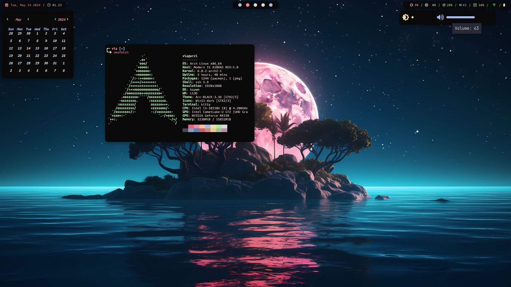

# new_bspwm
|Name|Description|
|-|-|
|OS|Arch Linux|
|init run|systemd|
|WM|bspwm|
|Keybinding Manager|sxhkd|
|Compositor|[picom](https://github.com/yshui/picom)|
|Panel bar|[Polybar](https://aur.archlinux.org/packages/polybar-git)|
|Widget|[eww](https://aur.archlinux.org/packages/eww-x11)|
|Notification Daemon|[deadd-notification-center](https://github.com/phuhl/linux_notification_center)|
|Lockscreen Daemon|[multilockscreen](https://github.com/jeffmhubbard/multilockscreen)|
||[xss-lock](https://archlinux.org/packages/extra/x86_64/xss-lock/)|
|Clipboard Manager|[clipmenud](https://github.com/cdown/clipmenu)|
|Battery Notification|[bato](https://github.com/doums/bato)|
|Display Manager|lightdm|
||lightdm-webkit2-greeter|
||[aqua](https://github.com/paysonwallach/aqua-lightdm-webkit-theme)|
|Fonts|[UbuntuMono Nerd Font](https://github.com/ryanoasis/nerd-fonts/releases/download/v3.2.1/UbuntuSans.zip)|
||[feather](https://github.com/adi1090x/polybar-themes/raw/master/fonts/feather.ttf)|
||[fontawesome](https://archlinux.org/packages/extra/any/ttf-font-awesome/)|
||[JetBrainsMono Nerd Font](https://github.com/ryanoasis/nerd-fonts/releases/download/v3.2.1/JetBrainsMono.zip)|
|Screenshot|flameshot|
|Terminal|kitty|
|Terminal Multiplexer|tmux|
|Shell|zsh|
|ZSH Plugin|zsh-fzf-plugin|
||git|
||archlinux|
||zsh-autosuggestions|
||zsh-syntax-highlighting|
||fzf-tab|
||zsh-async|
|Code Editor|neovim|
|ls replacement|eza|
|cat replacement|bat|
|GTK Theme|[Arc-BLACK-3.36](https://www.gnome-look.org/p/1329022)|
|GTK Icon|[Win11-dark](https://www.gnome-look.org/p/1546069/)|
|File Manager|Thunar|
|Mouse Cursor|[Bibata-Modern-Classic](https://www.gnome-look.org/p/1914825/)|

## Screenshot

